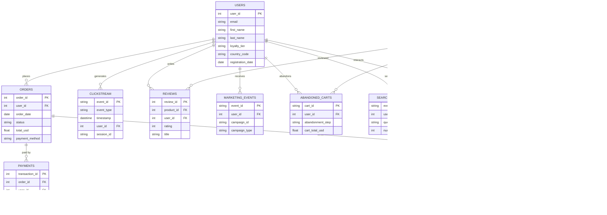
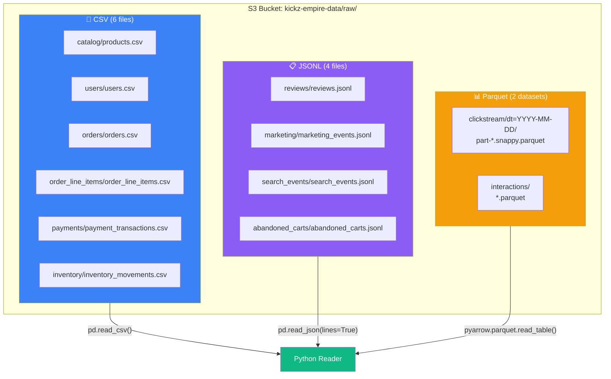

# KICKZ EMPIRE — Data Architecture

## Pipeline Overview

The ELT pipeline reads raw data from an **S3 data lake** (3 file formats), loads it **as-is** into a PostgreSQL Bronze layer, then cleans it (Silver) and aggregates it (Gold).

```mermaid
graph LR
    subgraph S3["☁️ S3 Data Lake &lpar;kickz-empire-data/raw/&rpar;"]
        direction TB
        subgraph CSV["📄 CSV Files"]
            P["products.csv<br/>~230 rows"]
            U["users.csv<br/>~5,000 rows"]
            O["orders.csv<br/>~17,000 rows"]
            OL["order_line_items.csv<br/>~31,000 rows"]
            PAY["payments.csv<br/>~18,000 rows"]
            INV["inventory.csv<br/>~51,000 rows"]
        end
        subgraph JSONL["📋 JSONL Files"]
            R["reviews.jsonl<br/>~3,000 rows"]
            M["marketing.jsonl<br/>~77,000 rows"]
            SE["search_events.jsonl<br/>~30,000 rows"]
            AC["abandoned_carts.jsonl<br/>~11,000 rows"]
        end
        subgraph PQ["📊 Parquet &lpar;Partitioned&rpar;"]
            CL["clickstream/<br/>dt=YYYY-MM-DD/*.parquet<br/>~544,000 rows"]
            INT["interactions/<br/>~120,000 rows"]
        end
    end

    subgraph Pipeline["⚙️ Python ELT Pipeline"]
        EX["🥉 Extract<br/>extract.py<br/>boto3 + pandas + pyarrow"]
        TR["🥈 Transform<br/>transform.py<br/>Clean &amp; Conform"]
        GD["🥇 Gold<br/>gold.py<br/>Aggregate"]
    end

    subgraph RDS["🐘 PostgreSQL &lpar;AWS RDS&rpar;"]
        subgraph Bronze["🥉 Bronze Schema"]
            B1["products"]
            B2["users"]
            B3["orders"]
            B4["order_line_items"]
            B5["reviews"]
            B6["clickstream"]
        end
        subgraph Silver["🥈 Silver Schema"]
            S1["dim_products"]
            S2["dim_users"]
            S3a["fct_orders"]
            S4["fct_order_lines"]
        end
        subgraph Gold["🥇 Gold Schema"]
            G1["daily_revenue"]
            G2["product_performance"]
            G3["customer_ltv"]
        end
    end

    CSV --> EX
    JSONL --> EX
    PQ --> EX
    EX --> Bronze
    Bronze --> TR
    TR --> Silver
    Silver --> GD
    GD --> Gold

    style S3 fill:#232f3e,color:#fff
    style CSV fill:#3b82f6,color:#fff
    style JSONL fill:#8b5cf6,color:#fff
    style PQ fill:#f59e0b,color:#fff
    style Pipeline fill:#f3f4f6,color:#111
    style Bronze fill:#cd7f32,color:#fff
    style Silver fill:#c0c0c0,color:#111
    style Gold fill:#ffd700,color:#111
    style RDS fill:#336791,color:#fff
```

---

## Medallion Architecture

| Layer | Schema | Purpose | Tables |
|-------|--------|---------|--------|
| **🥉 Bronze** | `bronze_groupN` | Raw data copied **as-is** from S3. No transformation. | 6 core + 6 bonus |
| **🥈 Silver** | `silver_groupN` | Cleaned & conformed. `_*` columns removed, PII stripped, types fixed. | 4 (dim/fct) |
| **🥇 Gold** | `gold_groupN` | Business-ready aggregations for dashboards and reports. | 3 |

---

## Entity Relationship Diagram

All 12 datasets and their relationships:

---

## File Formats in the Data Lake

---

## Tech Stack

| Component | Technology |
|-----------|-----------|
| **Data Lake** | AWS S3 (3 formats: CSV, JSONL, Parquet) |
| **Database** | AWS RDS PostgreSQL |
| **Language** | Python 3.10+ |
| **Libraries** | pandas, SQLAlchemy 2.0, boto3, pyarrow, psycopg2-binary |
| **Config** | python-dotenv (`.env` file) |
| **Testing** | pytest (TP3) |
| **CI/CD** | GitHub Actions (TP4) |
